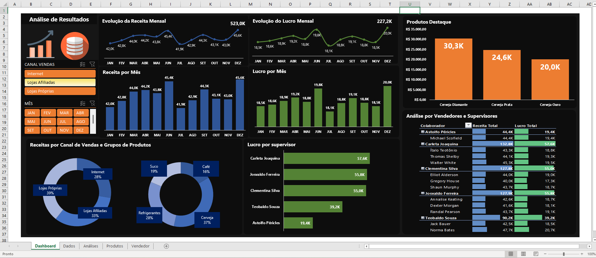

# Dashboard_de_Analise_de_Resultados_-Vendas-_em_Excel

# Dashboard de Análise de Resultados (Vendas) em Excel

Este projeto consiste em um dashboard de análise de resultados, focado em Receitas e Lucros, desenvolvido inteiramente no Microsoft Excel. O objetivo é demonstrar habilidades em análise de dados, visualização de informações e domínio avançado de ferramentas de Business Intelligence no Excel, como Tabelas Dinâmicas, Gráficos Dinâmicos e Segmentação de Dados.

O dashboard foi criado com dados fictícios para fins de portfólio.

## 📊 Visualização do Dashboard

## 🎯 Objetivo do Projeto

O dashboard foi projetado para fornecer uma visão clara e interativa do desempenho de vendas, permitindo que gestores e analistas possam tomar decisões informadas rapidamente.

### Perguntas de Negócio Respondidas:

O painel responde às seguintes perguntas-chave:

* Qual a evolução da **Receita** mês a mês?
* Qual a evolução do **Lucro** mês a mês?
* Quais são os **3 produtos** que geram maior Lucro?
* Qual a proporção de Receita por **Canal de Venda**?
* Qual a proporção de Receita por **Grupo de Produto**?
* Como se compara o desempenho (Lucro) de cada **Supervisor**?
* Qual o detalhamento de Receita e Lucro por **Vendedor**, agrupado por Supervisor?

## ✨ Funcionalidades e Recursos

* **Interatividade Total:** O dashboard permite a filtragem dinâmica de todos os gráficos e indicadores através de dois filtros principais (Segmentação de Dados):
    * Canal de Vendas
    * Mês
* **Visão Geral e Detalhada:** O painel combina KPIs (Key Performance Indicators) de alto nível (como evolução mensal) com análises detalhadas (como desempenho por vendedor).
* **Múltiplas Visualizações:** Utilização de diversos tipos de gráficos para melhor representar os dados:
    * **Gráficos de Linha:** Para tendências e evolução (Receita e Lucro Mensal).
    * **Gráficos de Coluna:** Para comparações de valores (Receita/Lucro por Mês e Top 3 Produtos).
    * **Gráficos de Rosca (Donut):** Para análise de proporção (Canal de Vendas e Grupo de Produtos).
    * **Gráfico de Barras:** Para ranking de desempenho (Lucro por Supervisor).
    * **Tabela:** Para visualização detalhada de Receita e Lucro por Vendedor.

## 🛠️ Tecnologias e Ferramentas Utilizadas

* **Microsoft Excel**
    * Tabelas Dinâmicas (PivotTables)
    * Gráficos Dinâmicos (PivotCharts)
    * Segmentação de Dados (Slicers)
    * Fórmulas e Funções
    * Design de Painel (Dashboarding)

## 📁 Como Utilizar

1.  Faça o download do arquivo `.xlsx` deste repositório.
2.  Abra o arquivo no Microsoft Excel (versão 2013 ou superior é recomendada para melhor compatibilidade).
3.  Interaja com os filtros de **Canal de Vendas** e **Mês** para ver a atualização dinâmica de todos os gráficos.

## 👤 Autor

* **Bruno Lemos**
* www.linkedin.com/in/bruno-lemos-dados
  
